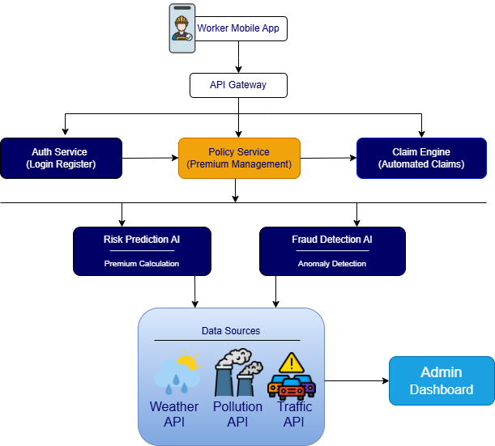
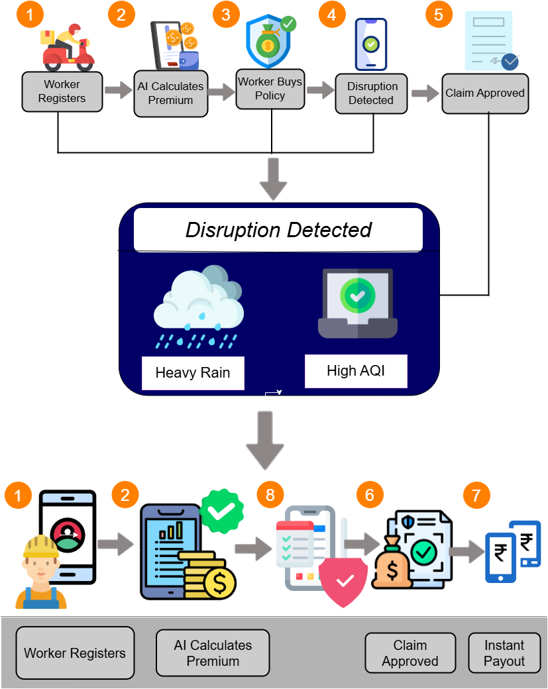

# ShieldGig AI
### Predictive Income Protection Ecosystem for Gig Workers

ShieldGig AI is an AI-powered parametric insurance platform designed to protect gig economy workers from income loss caused by environmental and urban disruptions.

Unlike traditional insurance systems that require manual claims, ShieldGig AI automatically detects disruptions using real-time data and triggers instant payouts.

Beyond compensation, the platform predicts risks, prevents income loss, and helps gig workers make smarter decisions.

---

# 🚀 Vision

To build the world's first **AI-driven income protection ecosystem** that ensures financial stability for gig workers in unpredictable environments.

---

# ❗ Problem Statement

Gig workers rely on daily earnings for survival. However, environmental and urban disruptions such as:

- Heavy rainfall  
- Extreme heat  
- Air pollution  
- Traffic congestion  
- Floods and curfews  

can reduce their income by **20–30% weekly**.

Existing insurance systems only cover:
- Health  
- Accidents  
- Vehicle damage  

❌ They do NOT protect **daily income loss**.

---

# 💡 Solution Overview

ShieldGig AI introduces a **Predict → Prevent → Protect → Compensate** model.

### 🔮 Predict
AI forecasts disruptions and income risk.

### 🛡 Prevent
Workers get alerts and safe-zone recommendations.

### 💼 Protect
Workers subscribe to affordable weekly insurance.

### 💰 Compensate
Automatic payouts triggered when disruptions occur.

---

# 👤 Target Users

Gig delivery workers from platforms like:

- Swiggy  
- Zomato  
- Dunzo  
- Blinkit  
- Uber Eats  

### Example Persona

Ravi Kumar – Chennai  
Daily Income: ₹600  
Weekly Income: ₹3500  

---

# ⭐ Core Features

- AI-based dynamic premium calculation  
- Real-time disruption monitoring  
- Automated parametric claims  
- Instant digital payouts  
- Hyperlocal risk prediction  
- Safe zone navigation  
- Fraud detection AI  
- Earnings dashboard  

---

# 🧠 Advanced AI Innovations

### Income Stability Engine ⭐
Predicts income volatility and expected losses.

### Earnings Stability Score ⭐
Provides a score (0–100) indicating worker risk level.

### Dynamic Coverage Booster ⭐
Automatically increases coverage during high-risk conditions.

---

# 🤖 AI Components

- Risk Prediction Model  
- Disruption Forecasting Model  
- Income Loss Prediction Model  
- Fraud Detection Model  

---

# ⚡ Parametric Triggers

| Trigger | Condition |
|--------|----------|
| Rain | > 40 mm |
| Heat | > 42°C |
| AQI | > 350 |
| Flood | Govt alerts |
| Traffic | Road closures |

---

# 💸 Weekly Premium Model

| Risk | Premium | Coverage |
|------|--------|---------|
| Low | ₹15 | ₹300 |
| Medium | ₹25 | ₹500 |
| High | ₹40 | ₹800 |

---

# 🏗 System Architecture

---

# 🔄 System Workflow

1 Register  
2 Risk analysis  
3 Buy coverage  
4 Monitor APIs  
5 Disruption detected  
6 Claim triggered  
7 AI verification  
8 Instant payout  

---

# 🚨 Adversarial Defense & Anti-Spoofing Strategy

## 🔍 Differentiation

ShieldGig AI uses **AI-based Trust Scoring**, not just GPS.

✔ Genuine:
- Movement patterns  
- Delivery activity  
- Real-world consistency  

❌ Fraud:
- Static spoofed location  
- No activity  
- Data mismatch  

---

## 📊 Data Used

- Behavioral data (orders, movement)  
- Device data (sensor, device ID)  
- Environmental validation  
- Network patterns (mass claims)  
- Historical trust score  

---

## 🤖 Fraud Detection AI

- Anomaly Detection  
- Pattern Clustering  
- Risk Scoring  

Low Risk → Auto  
Medium → Verify  
High → Review  

---

## ⚖ UX Balance

- Soft verification  
- Grace approval  
- Delayed validation  
- Transparent user messages  

---

## 🛡 System Protection

- Multi-layer validation  
- Real-time fraud monitoring  
- Adaptive AI models  
- Rate limiting  

---

# 💼 Business Model

- Weekly micro premiums  
- B2B partnerships with gig platforms  
- Data analytics for insurers  

---

# 🌍 Real-World Feasibility

ShieldGig AI can integrate with gig platforms via APIs.

Deployment options:
- Mobile app  
- API service  
- Insurance provider integration  

---

# 🏆 Competitive Advantage

- Predictive AI (not reactive)  
- Automated claims  
- Anti-spoofing fraud detection  
- Worker guidance system  

---

# 🔮 Future Enhancements

- AI disruption forecasting  
- Community risk reporting  
- Hyperlocal heatmaps  
- Emergency savings wallet  

---

# 📈 Expected Impact

- Reduce income volatility  
- Faster claim payouts  
- Fraud-resistant insurance  
- Better worker decisions  

---

# 📌 Project Status

Prototype Phase

---

# 👥 Team

DEVTrails Hackathon 2026
